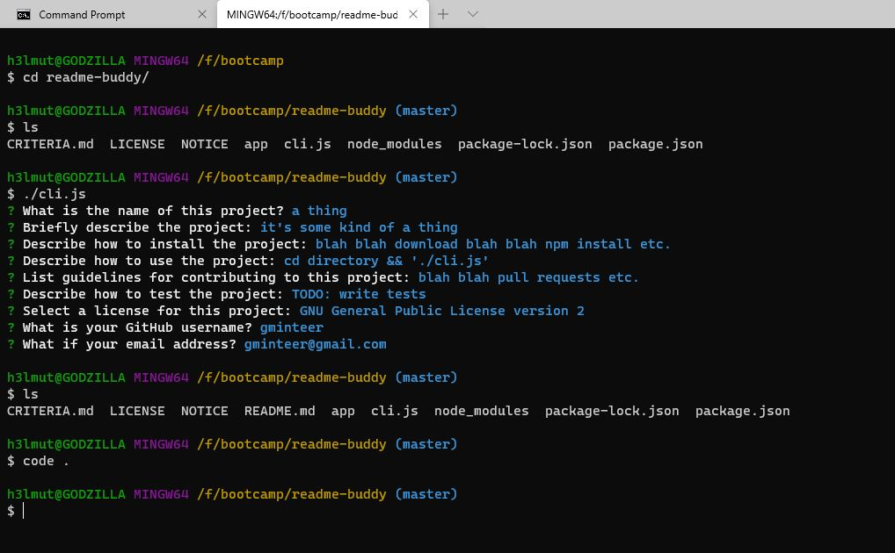

# ReadmeBuddy!

###

## Description

---

Automatically generate professional, high-quality README files [like this](assets/readme/SAMPLE.md) for your projects.

## Table of Contents

---

- [Installation](#installation)
- [Usage](#usage)
- [License](#license)
- [Contributing](#contributing)
- [Tests](#tests)
- [Questions](#questions)

## Installation

---

Download this repository into a directory on your PC, then run "npm install" in that directory.

## Usage

---

Run "cli.js" in the directory ReadmeBuddy was installed in.

## License

---

Copyright 2020 gminteer@gmail.com

Licensed under the Apache-2.0 License (the "License");
you may not use this file except in compliance with the License.
You may obtain a copy of the License at

<http://opensource.org/licenses/Apache-2.0>

Unless required by applicable law or agreed to in writing, software
distributed under the License is distributed on an "AS IS" BASIS,
WITHOUT WARRANTIES OR CONDITIONS OF ANY KIND, either express or implied.
See the License for the specific language governing permissions and
limitations under the License.

## Contributing

---

Contact me via GitHub or email.

## Tests

---

TODO: write tests.

## Questions

---

Any additional questions? Comments? Contact me on [GitHub](https://github.com/gminteer) or email me at [gminteer@gmail.com](mailto:gminteer@gmail.com).

